# Readme

## Inhalt

|  |  |
|--|--|
| [Ordnerstruktur](#ordnerstruktur) | [Ansatz](#ansatz) |
| [Hintergrund](#hintergrund) | [Samples](#samples) |
| [Filterung](#filterung) | [Audionetzwerk](#audionetzwerk) |
| [3D](#3d) | [Kompressor](#kompressor) |
| [Mehrfachverwendung](#mehrfachverwendung) | [Mix](#mix) |

---

### Ordnerstruktur
Das Projekt besteht aus drei selbsterklärenden Ordnern: **code**, **result**, **snds**. 
**snds** befindet sich aufgrund seiner Größe bei den Releases.
In **result** finden sich zwei Testresultate: *result1*, *result2* mit je 3 Minuten Länge.

---

### Ansatz

SuperCollider hilft dabei, komplexe Audiosynthese in kleinere, wiederverwendbare Teile zu zerlegen. Das macht es einfacher, den Code zu testen und zu debuggen.
Funktionen können gleichzeitig ausgeführt werden. Das ist wichtig für die Verarbeitung von Audio in Echtzeit.  Außerdem können die Hardware-Ressourcen besser genutzt werden.
Der gesamte Code unterliegt somit dem Programmierparadigma der funktionalen Programmierung. Funktionen werden definiert und kontinuierlich als Daten übergeben. Das hörbare Ergebnis ist ebenfalls ein Funktionsergebnis. 

Der generelle Aufbau wird mit diesem Sequenzdiagramm verdeutlicht:

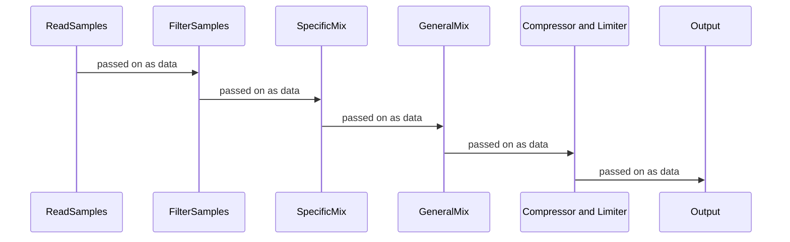

---

### Hintergrund
Es gibt spezielle Musikprogramme, die auf die Bedürfnisse der Kunden zugeschnitten sind, sei es, um die Produktivität der Mitarbeiter zu steigern oder um die Kunden zu animieren und beim Lernen zu unterstützen.

Ein Trend der letzten Jahre ist zudem die Hintergrundmusik auf der Plattform Youtube.

Vom Lofi Girl ([Lofi Girl](https://www.youtube.com/watch?v=jfKfPfyJRdk)) über Sci-Fi-Ambient ([Secret Planet](https://www.youtube.com/watch?v=9OHPfCa6BZs)) bis hin zu Ambience-Videos, die dem Zuhörer das Gefühl vermitteln sollen, in einem Café zu sitzen ([Cozy Fall Coffee Shop Ambience](https://www.youtube.com/watch?v=VMAPTo7RVCo)). \
Hintergrundmusik boomt und die Playlists erreichen zum Teil mehrere Millionen Aufrufe.

Der nachfolgende Code simuliert den Aufenthalt in einem Café. 

---
### Samples

Alle verwendeten Samples befinden sich im Ordner **snds** (siehe Releases).
Sie unterteilen sich thematisch in *technical*, *voices*, *barrista*, *chatter* und *background*. 

|Thema                         |Name       |Quelle|
|---------------------|-----------------------------|--
|technical||
||pour_coffee|[X](https://www.youtube.com/watch?v=G5oV9iTnin4)|
||cups|[X](https://www.youtube.com/watch?v=Dcs7HvRqy-E)|
||coffee_mill|[X](https://www.youtube.com/watch?v=E9Ya6y_vVpE)|
||more_cups|[X](https://www.youtube.com/watch?v=j7kGlSF7MTg)|
||machines_ready|[X](https://www.youtube.com/watch?v=ukXuk6mGfkM)|
||plates|[X](https://www.youtube.com/watch?v=nUCnw7fG2VY)|
|voices||
||some_water|[X](https://www.youtube.com/watch?v=o7m6d_GEzVA)|
||hot_chocolate|[X](https://www.youtube.com/watch?v=ukXuk6mGfkM)|
||male_voice|[X](https://www.youtube.com/watch?v=4FimBgEXk2s)|
|barrista||
||baked_goods|[X](https://www.youtube.com/watch?v=nUCnw7fG2VY)|
||own_blend|[X](https://www.youtube.com/watch?v=G5oV9iTnin4)|
||anecdote|[X](https://www.youtube.com/watch?v=6uPjAjbM1Mg)|
|chatter||
||chatter|[X](https://www.youtube.com/watch?v=qMSrFGT2FK0)|
||chatter_two|[X](https://www.youtube.com/watch?v=ZSrVznkaMEM)|
||chatter_three|[X](https://www.youtube.com/watch?v=TwUv7JvgmKA)|
|background||
||ppltalking|[X](https://www.youtube.com/watch?v=_otFi2e263A)|
||jazz|[X](https://www.youtube.com/watch?v=j4r1nwARENE)|

Jedes Samples durchläuft einen Filterungsprozess. 

Der Prozess nach dem Laden: 

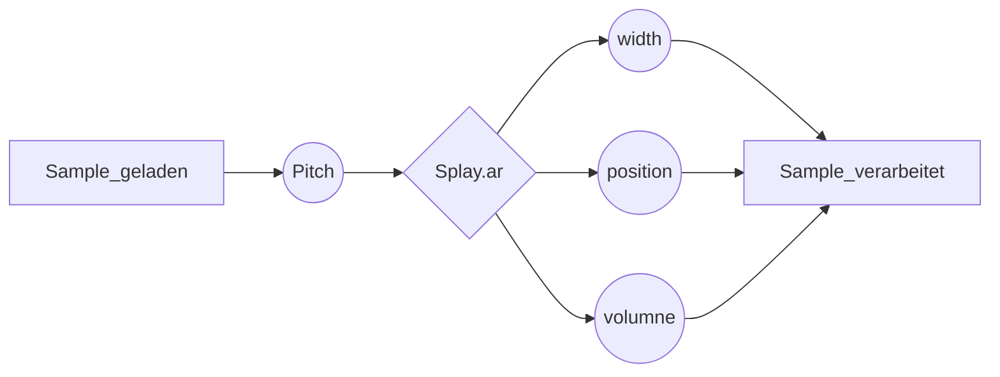
Der *Pitch* wird einmalig festgelegt. Die Eigenschaften *width*, *position* und *volume* oszillieren in einem bestimmten Intervall, das von Sample zu Sample variiert. 

Für das Oszillieren wird ein nicht-bandbegrenzter Sägezahn-Oszillator verwendet. 

---
### Filterung 
Mit Ausnahme der Samples im Bereich *chatter* und *background* werden alle Samples durch einen Resonator gefiltert. Dadurch werden bestimmte Frequenzen mit größerer Amplitude wiedergegeben. Das Ergebnis ist eine teils klare, teils dumpfe Klangqualität.

Der Prozess:

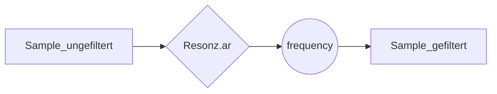

Die Frequenzbereiche, in denen die Abtastwerte schwingen, sind aufeinander abgestimmt und schwingen mit einem nicht bandbegrenzten Sägezahnoszillator in einem bestimmten Intervall.

---
### Audionetzwerk
Nach der Filterung durch den Resonator werden die Samples in die dafür vorgesehenen Audionetzwerke eingespeist. 

Es existieren:

 - network technical
 - network voice
 - network chatter
 - network barrista
 - network general
 
Jedes Audionetzwerk verwendet eine Reihe von zweikanaligen Crossfadern. Die Netzwerke unterscheiden sich in ihrer Struktur. Die Netze *technical, voice, chatter und barrista* werden schließlich im *general* Netzwerk verarbeitet.

Die schematische Darstellung verzichtet aus Gründen der Übersichtlichkeit auf die Faderklasse.

Aufbau *network technical*: 

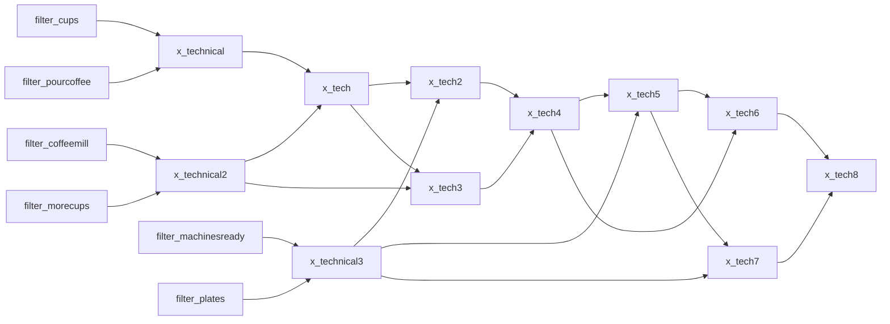
Aufbau *network voice*: 
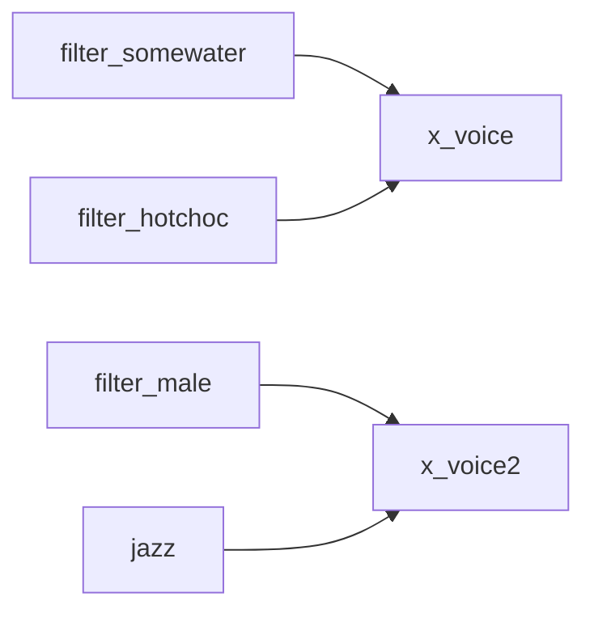

Aufbau *network chatter*: 
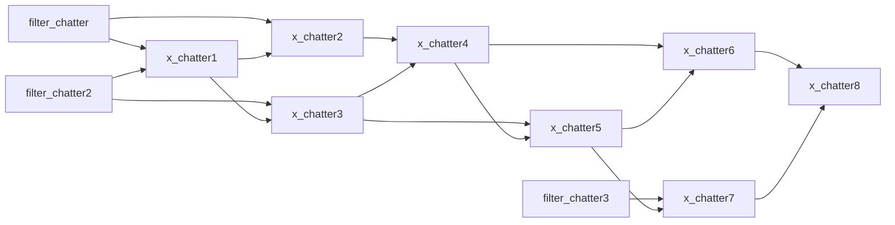

Aufbau *network barrista*: 
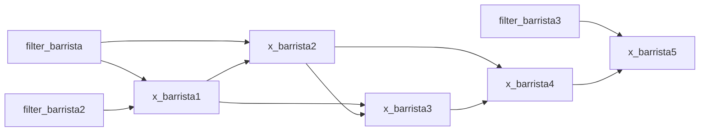
Aufbau *network general*: 
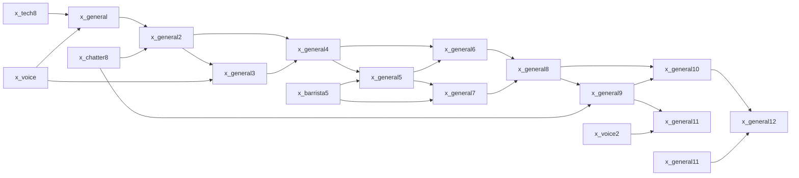

---

### 3D
Nach der Erstellung der Audionetzwerke werden sowohl das Netzwerk *x_general12* als auch das Sample *backgroundnoise* in zwei separate Gleichungen eingesetzt, die den Klang links und rechts bzw. oben und unten abwechseln lassen. Bei *x_general12* wird sowohl links und rechts als auch oben und unten mit einem Sägezahnoszillator gearbeitet. Bei *backgroundnoise* wird der Klang nur links und rechts variiert.

Aufbau *roomnoise*
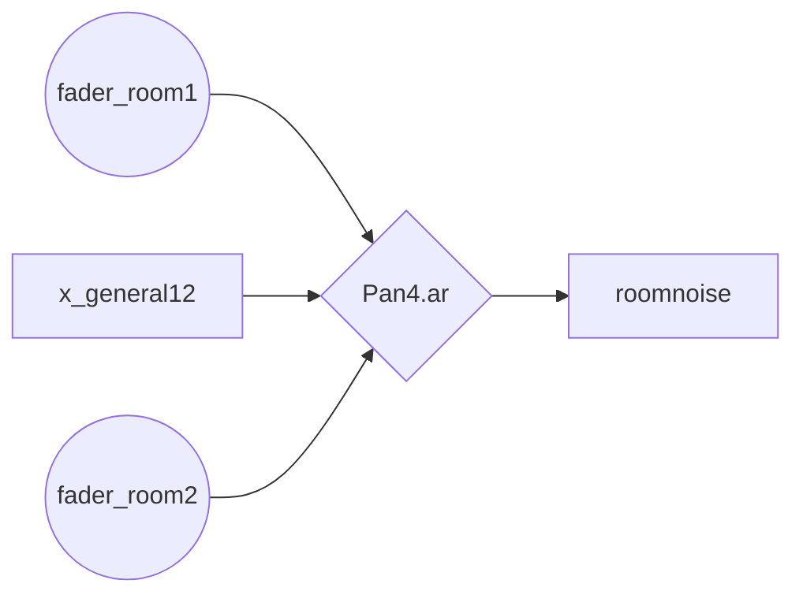

Aufbau *roombackground*
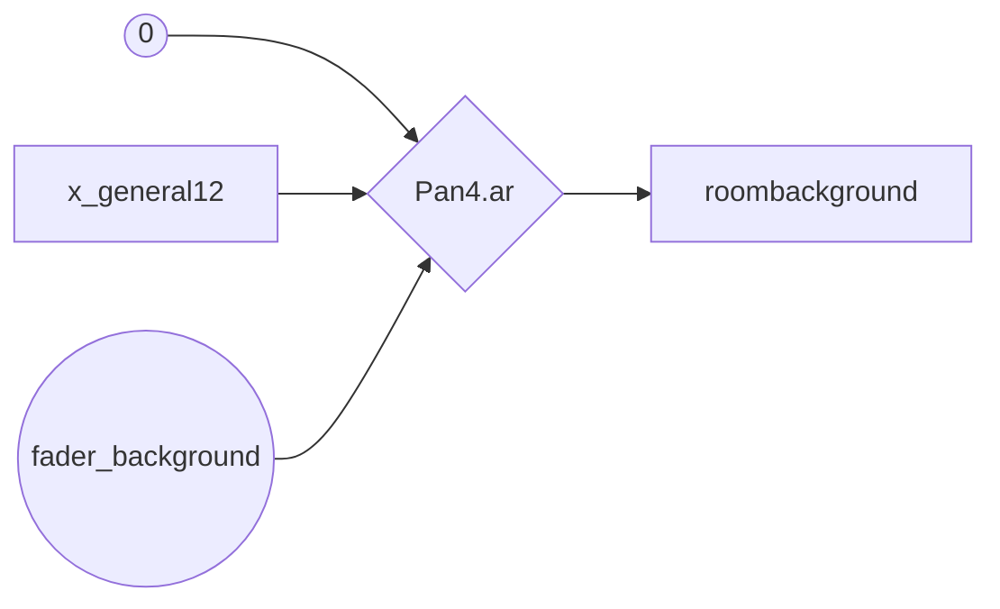

---
### Kompressor
Der nächste Schritt ist die Übergabe von *roombackground* und *roomnoise* an Kompressor und Limiter. In beiden Fällen werden die Werte nur einmal gesetzt. Die entsprechenden Variablen heißen *compressor* und *normal*. 

Aufbau *compressor*:

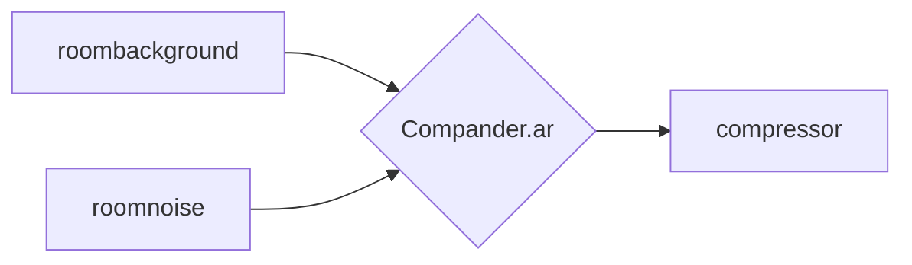

Aufbau *normal*: 
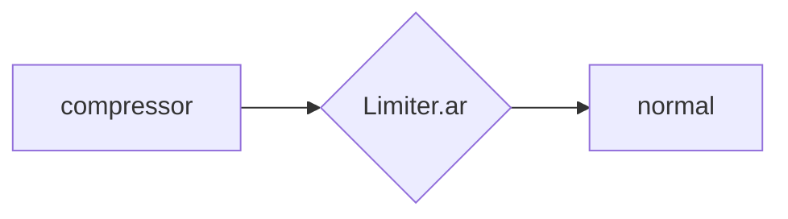

---

### Mehrfachverwendung
Die Klasse *Splay.arFill* ermöglicht es eine Reihe von Audiokanälen über das Stereofeld zu verteilen. Die Variable *normal*, die das bisher erzeugte Audiosignal enthält, wird nun 30 mal verwendet und in der Variable *spread* gelagert. Die sonstigen Werte wurden gesetzt. 

Aufbau *spread*: 
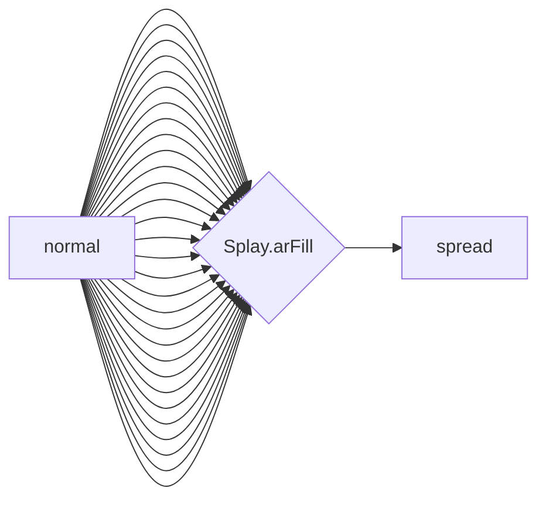

---
### Mix
Im letzten Schritt mischt *Mix.new* eine Reihe von Kanälen, in dem Fall 12 mal *spread* auf einen einzigen Kanal herunter.

Aufbau *Mix.new*:
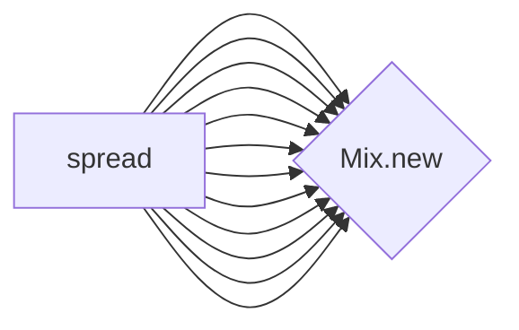

